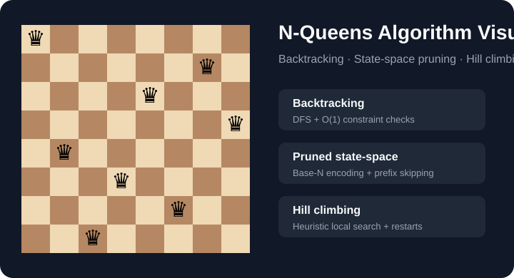

# N-Queens Algorithm Visualizer ♛



A compact Python project for **solving, comparing, and visualizing the N-Queens problem** with three different algorithmic strategies:

- **Backtracking** — depth-first search with row and diagonal constraint checks.
- **Pruned state-space search** — encodes boards as base-`N` states and skips invalid prefix regions.
- **Hill climbing** — heuristic local search that exposes local minima and optional random restarts.

This repository is a cleaned and re-engineered version of an earlier university **Algorithm Design and Analysis** course project. The public version focuses on reproducibility, algorithm comparison, tests, and cross-platform execution rather than preserving the original IDE/course-submission structure.

> 中文说明见 [README.zh-CN.md](README.zh-CN.md).

## Why this project?

N-Queens is small enough to understand visually but rich enough to demonstrate several core CS ideas: constraint satisfaction, depth-first search, pruning, state-space representation, heuristic search, local minima, reproducible experiments, and empirical performance analysis.

## Quick start

Requirements: **Python 3.10+**. The core algorithms use only the standard library.

```bash
git clone <your-repository-url>
cd n-queens-algorithm-visualizer

python main.py solve --algorithm backtracking --n 8
```

Compare all three approaches:

```bash
python main.py compare --n 8
```

Enumerate all 92 solutions to the classic Eight Queens problem:

```bash
python main.py solve --algorithm backtracking --n 8 --all
```

Run hill climbing with a reproducible seed and random restarts:

```bash
python main.py solve --algorithm hill-climbing --n 8 --seed 42 --restarts 100
```

Launch the GUI:

```bash
python main.py visualize
```

The GUI uses Tkinter, which is included with most Python installations. Some minimal Linux distributions require installing the system Tk package separately.

## Example CLI output

```text
algorithm: backtracking
n: 8
solutions found: 1
placements visited: ...
elapsed: ...s

solution rows by column: (...)
+---+---+---+---+---+---+---+---+
| Q |   |   |   |   |   |   |   |
...
```

Exact timings depend on the machine and Python version.

## Algorithms

### 1. Backtracking

Builds the board one column at a time. Invalid placements are rejected immediately using sets for occupied rows and diagonals. It is **complete** and can enumerate every solution.

### 2. Pruned state-space search

Treats a board as an `N`-digit base-`N` number. A naive approach would examine all `N^N` row assignments. When the first conflicting queen is found, the solver jumps over the remaining states that share the same invalid prefix.

This version preserves the most distinctive idea from the original course project while separating the algorithm from GUI code.

### 3. Hill climbing

Starts from a random board and repeatedly moves one queen to a state with fewer attacking pairs. It is fast and memory-light, but unlike exhaustive search it can become trapped in a **local minimum**. Optional random restarts demonstrate a standard way to improve practical success.

See [docs/algorithm-analysis.md](docs/algorithm-analysis.md) for a more detailed discussion.

## Benchmarking

Generate an empirical comparison for multiple board sizes:

```bash
python benchmarks/benchmark.py --n 4 5 6 7 8 9 --hill-trials 100
```

This writes `benchmark_results.csv` containing:

- board size,
- algorithm,
- success rate,
- a method-specific work metric,
- elapsed time.

The generated CSV is intentionally ignored by Git because benchmark numbers are hardware-dependent.

## Tests

The repository uses only standard `unittest`-compatible assertions, so the tests can be run with Python's built-in test runner:

```bash
python -m unittest discover -s tests -p "test_*.py"
```

The suite checks known solutions, the classic **92-solution** result for `N=8`, state-space pruning, and a reproducible hill-climbing run.

## Project structure

```text
.
├── main.py                       # convenient CLI entry point
├── pyproject.toml                # package metadata / optional installation
├── src/nqueens/
│   ├── backtracking.py           # DFS + constraint pruning
│   ├── state_space.py            # base-N enumeration + prefix skipping
│   ├── hill_climbing.py          # local search + random restarts
│   ├── board.py                  # validation and board utilities
│   ├── visualizer.py             # portable Tkinter GUI
│   └── cli.py                    # command-line interface
├── benchmarks/benchmark.py       # reproducible experiment script
├── tests/                        # automated tests
└── docs/
    ├── algorithm-analysis.md
    ├── original-project-notes.md
    └── demo.svg
```

## What changed from the original course version?

The original archive contained multiple experimental scripts, IDE metadata, a virtual environment, machine-specific paths, and Windows-specific GUI setup. The GitHub version:

- removes `venv`, `.idea`, generated archives, and private student identifiers;
- replaces absolute local file paths with portable code;
- separates algorithms from presentation logic;
- removes unnecessary third-party dependencies from the core solvers;
- replaces Windows-only Pygame embedding with a Tkinter GUI;
- adds a CLI, tests, benchmark tooling, type hints, and documentation;
- keeps the original algorithmic concepts while making the repository easier to review and run.

## Further ideas

Potential extensions include simulated annealing, min-conflicts, genetic algorithms, search-tree animation, symmetry-aware solution counting, and benchmark plotting.
